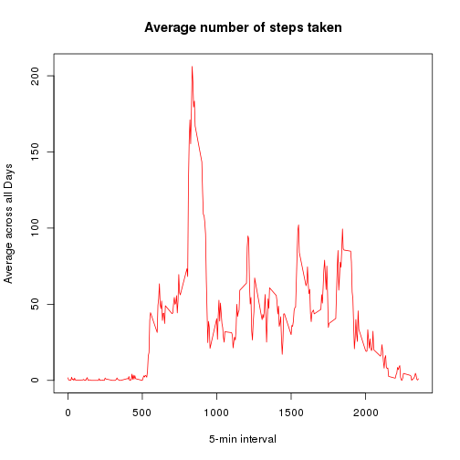

# Reproducible Research: Peer Assessment 1
========================================================
## LOADING AND PREPROCESSING DATA
Loading and preprocessing the data and process/transform the data (if necessary) into a format suitable for your analysis


```r
data <- read.csv("activity.csv")
colnames(data) <- c("steps", "date", "interval")
summary(data)
```

```
##      steps               date          interval   
##  Min.   :  0.0   2012-10-01:  288   Min.   :   0  
##  1st Qu.:  0.0   2012-10-02:  288   1st Qu.: 589  
##  Median :  0.0   2012-10-03:  288   Median :1178  
##  Mean   : 37.4   2012-10-04:  288   Mean   :1178  
##  3rd Qu.: 12.0   2012-10-05:  288   3rd Qu.:1766  
##  Max.   :806.0   2012-10-06:  288   Max.   :2355  
##  NA's   :2304    (Other)   :15840
```


## WHAT IS MEAN TOTAL NUMBER OF STEPS TAKEN PER DAY?
Make a histogram of the total number of steps taken each day

```r
tsteps <- aggregate(steps ~ date, data, sum)
hist(tsteps$steps, main = "Histogram of the total number of steps each day", 
    xlab = "Total steps")
```

 

Calculate mean and median

```r
mean <- mean(tsteps$steps)
print(mean)
```

```
## [1] 10766
```

```r
median <- median(tsteps$steps)
print(median)
```

```
## [1] 10765
```


## WHAT IS THE AVERAGE DAILLY ACTIVITY PATTERN?

Make a time series plot (i.e. type = "l") of the 5-minute interval (x-axis) and the average number of steps taken, averaged across all days (y-axis)


```r
datatime <- tapply(data$step, data$interval, mean, na.rm = TRUE)

plot(row.names(datatime), datatime, type = "l", xlab = "5-min interval", ylab = "Average across all Days", 
    main = "Average number of steps taken", col = "red")
```

 

Which 5-minute interval, on average across all the days in the dataset, contains the maximum number of steps?


```r
max <- which.max(datatime)
maxim <- names(max)
print(maxim)
```

```
## [1] "835"
```


## IMPUTING MISSING VALUES
Note that there are a number of days/intervals where there are missing values (coded as NA). The presence of missing days may introduce bias into some calculations or summaries of the data.

Calculate and report the total number of missing values in the dataset (i.e. the total number of rows with NAs)


```r
sum(is.na(data$steps))
```

```
## [1] 2304
```

Devise a strategy for filling in all of the missing values in the dataset. The strategy does not need to be sophisticated. For example, you could use the mean/median for that day, or the mean for that 5-minute interval, etc.
Devise a strategy for filling in all of the missing values in the dataset. The strategy does not need to be sophisticated. For example, you could use the mean/median for that day, or the mean for that 5-minute interval, etc.

Create a new dataset that is equal to the original dataset but with the missing data filled in.
We replace the na values with the mean:


```r
data_mean <- data
datanona <- na.omit(data)
dataagr <- aggregate(datanona, by = list(datanona$date), FUN = mean)

# data_mean$steps[is.na(data$steps)==dataagr$steps[dataagr$Group.1==data_mean$date]]
tmeansteps <- aggregate(steps ~ date, data_mean, sum)
hist(tmeansteps$steps, main = "Histogram of the total number of steps each day", 
    xlab = "Total steps")
```

 

```r

```

Make a histogram of the total number of steps taken each day and Calculate and report the mean and median total number of steps taken per day. Do these values differ from the estimates from the first part of the assignment? What is the impact of imputing missing data on the estimates of the total daily number of steps?


```r

meanna <- mean(tmeansteps$steps)
medianna <- median(tmeansteps$steps)
print(meanna)
```

```
## [1] 10766
```

```r
print(medianna)
```

```
## [1] 10765
```

